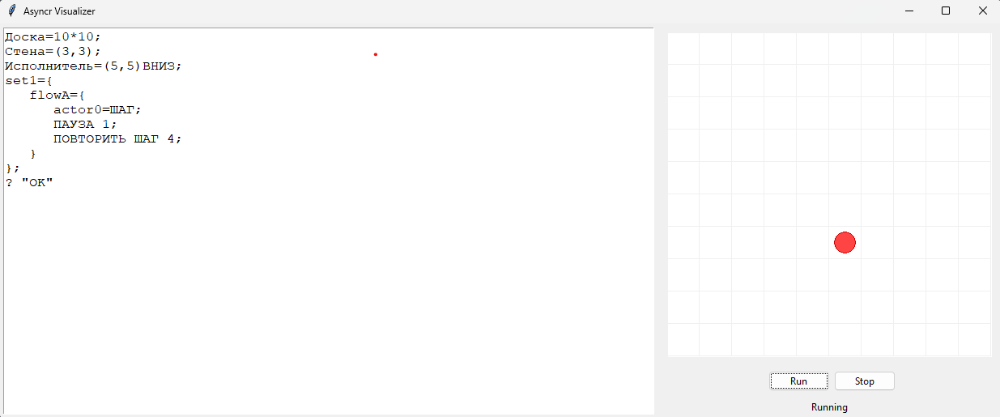

# Asynchr DSL

Asynchr — подьязык СИНХРО для асинхронного управления исполнителями на клеточном поле.  
Проект позволяет описывать сценарии поведения исполнителей, запускать их в асинхронных потоках и визуализировать выполнение.

## 🖼 Интерфейс
